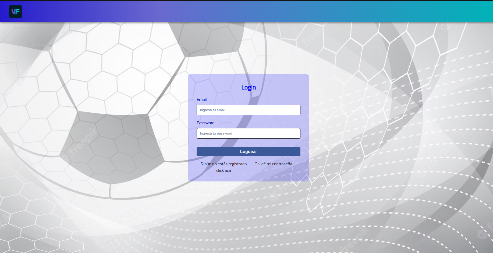
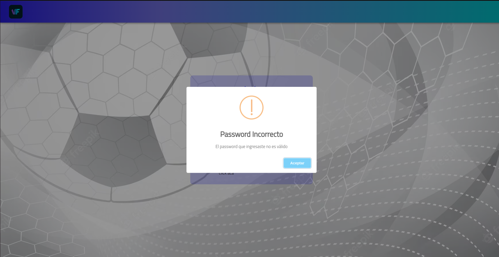
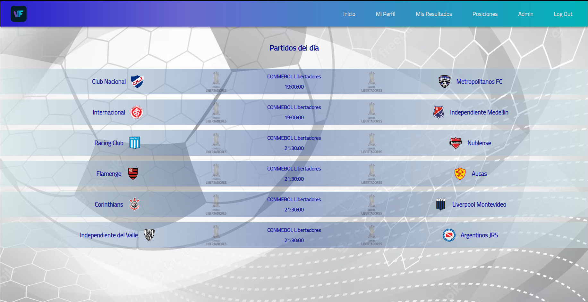
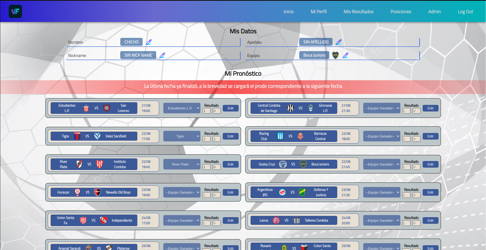
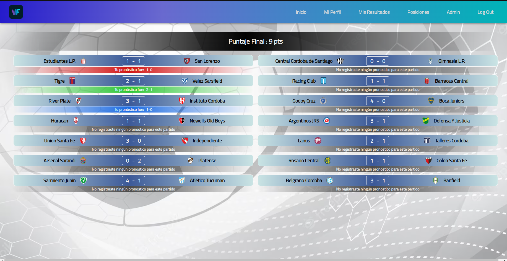
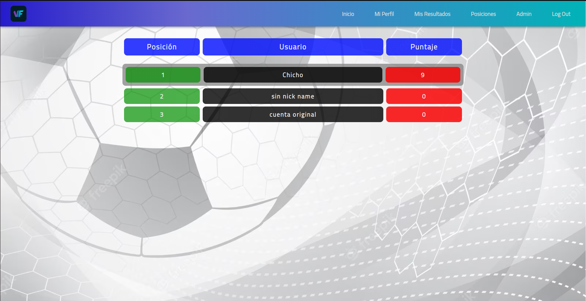

# viva-futbol

VIVA-Futbol es un sistema que permite el registro de usuarios mediante un email y password, para realizar pronósticos sobre partidos de futbol de la Liga Profesional del Futbol Argentino. El usuario una vez registrado y posteriorior activación de cuenta por parte del administrador, podrá conocer el fixture de todos los partidos de la fecha de las ligas mas importantes del mundo. Luego en su perfil personal configurará datos personales, como nombre apellido, nickname y equipo favorito. Allí mismo se le mostrará un panel con los partidos de la próxima fecha del fubtol argentino, cono horarios equipos a enfrentarse y lugar. Allí establecerá antes del inicio del primer partido de a fecha su pronostico ar cada partido; una vez finalizada la fecha se mostrará su puntaje final, y por cada partido, obtenido y se lo colocará en una tabla de posiciones con los demás usuarios registrados.
Los fixtures se actualizan de manera dinámica mediante la utilización de una API externa llama API-FUTBOLL. Toda la información es almacenada en el firestore de Firebase, utilizando además el servicio de autenticación brindado por Firebase.
El proyecto fue creado con React, CSS puro, Firebase y librerías externas. Además actualmente está en proceso de crecimiento con nuevas funcionalidades.

## Imagenes

## Ejecutando este Proyecto

1. Abre la terminal de Git
2. Cambia el directorio de trabajo actual a la ubicación en donde quieres clonar el directorio.
   `cd proyecto`

3. Escribe git clone seguido de la [URL](https://github.com/emanuelheredia/viva-futbol) del proyecto

`git clone https://github.com/emanuelheredia/control-gastos `

4. Presiona Enter para crear tu clon local

    > $ git clone https://github.com/YOUR-USERNAME/YOUR-REPOSITORY
    > Cloning into `Spoon-Knife`...
    > remote: Counting objects: 10, done.
    > remote: Compressing objects: 100% (8/8), done.
    > remove: Total 10 (delta 1), reused 10 (delta 1)
    > Unpacking objects: 100% (10/10), done.

5. Instalar todas las dependencias necesarias dentro del directorio del proyecto
   `npm install`

6. Por último inicia el proyecto con npm start donde se iniciará el dashboard de expo en el navegador
   `npm start`

# Mis Redes :

-   [GITHUB](https://github.com/emanuelheredia)
-   [LINKEDIN](https://www.linkedin.com/in/emanuel-heredia-41749421a/)
